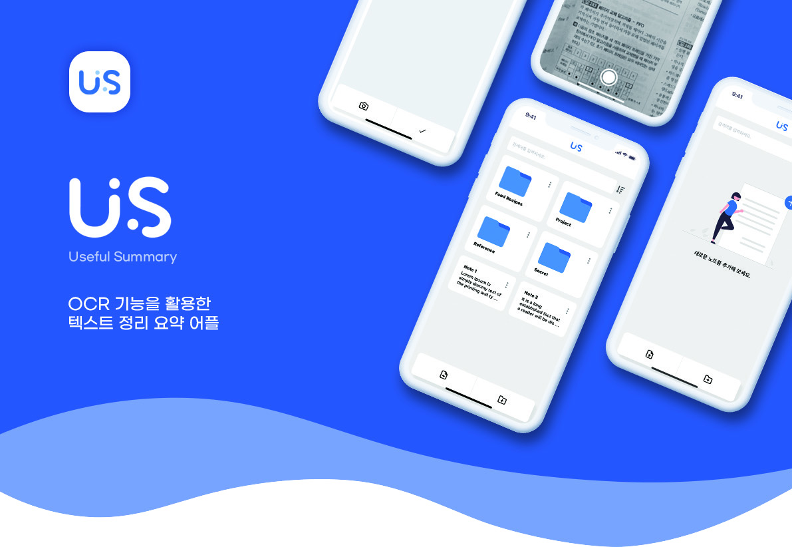
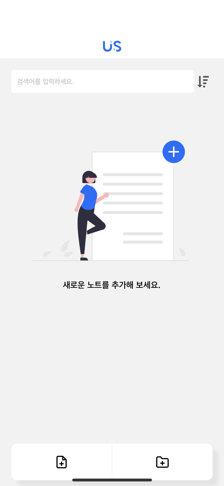
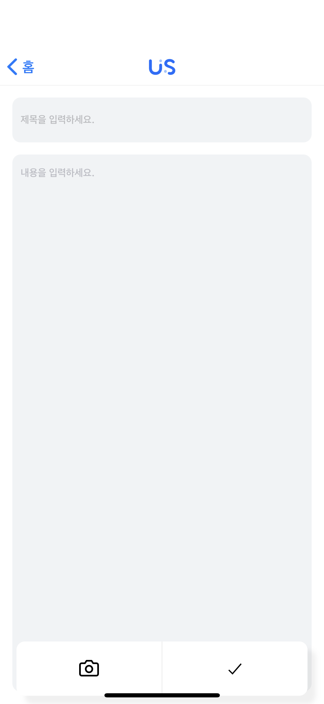
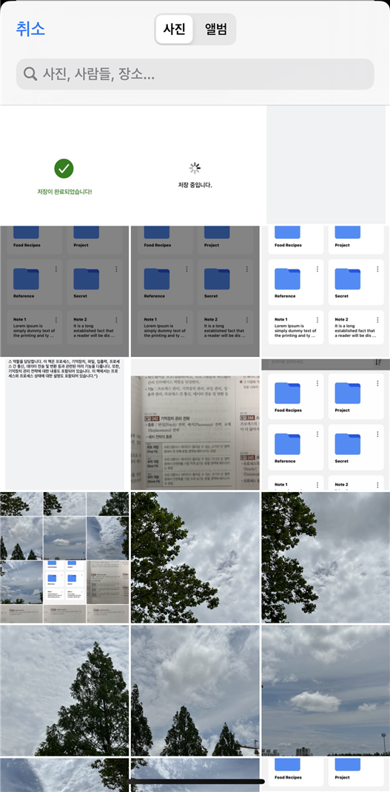
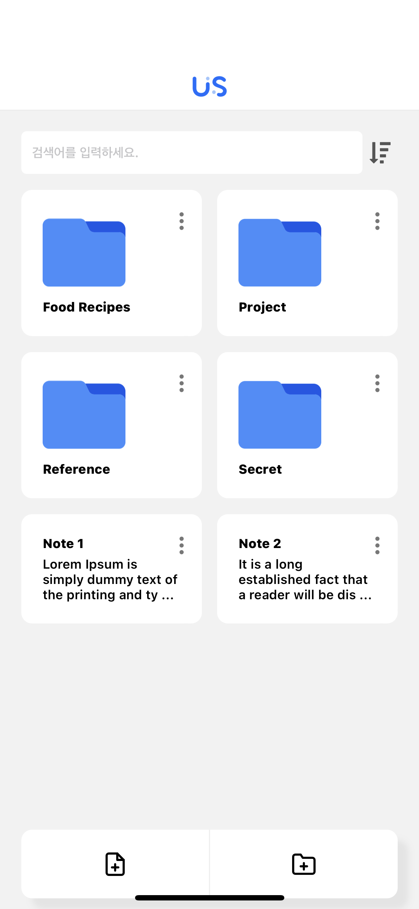

    

# US - Useful Summary

### 개발 배경
현대 사회에서는 교재나 노트 필기와 같은 텍스트 자료가 많이 사용되고 있다.  
그러나 이러한 자료들은 보통 방대하고 상세한 내용을 포함하고 있어서 효과적으로 활용하기 어렵다.  
따라서 이러한 문제를 해결하기 위해 OCR 기술을 이용하여 교재나 노트 필기의 텍스트를 인식하고, 이를 요약하는 어플을 개발하였다.
 
### 사용 기술

  
#### Frontend
   
#### Backend
  

 

## 주요 화면 스크린샷

| 설명      | 화면                                                    |
| --------- | ------------------------------------------------------- |
| 초기 화면 |            |
| 노트 작성  |       |
| 사진 요약 |            |
| 메모 저장 |            |

 

## 팀원 소개
| Frontend Developer | Frontend Developer | Backend Developer | Backend Developer | Backend Developer |
| ---------- | ---------- | ------ | ------ | ------ |
| 김가희 | 백승권 | 김성도 | 엄찬민 | 이진수 |
| UI/UX 설계 | 자료 조사 | Open AI API 관리 | Google Cloud Vision API 관리 | 데이터베이스 설계 |
